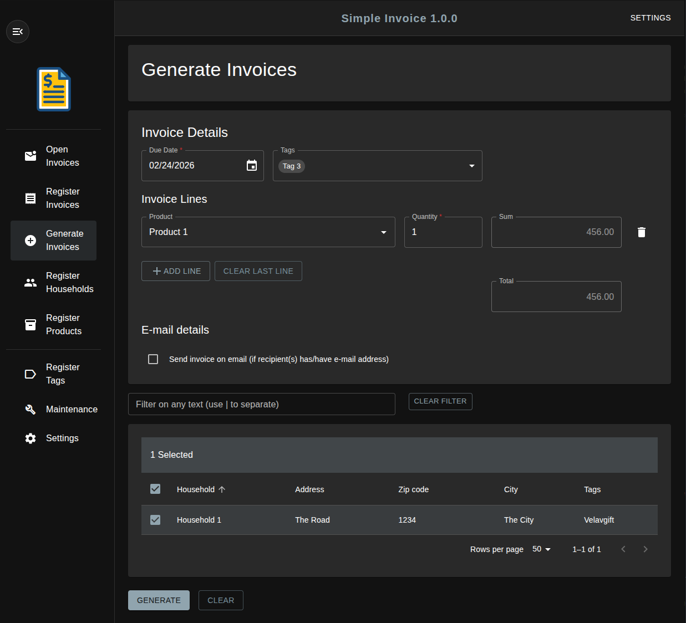

# Simple Invoice Server

This is the server for Simple Invoice. It provides an HTTP API used by the Simple Invoice App. The server is built
using [Ktor](https://ktor.io).

In addition to the server, the backend consists of a Postgres database to store the data, and a S3-compatible storage to
store the invoice files. The database is created automatically when the server is run for the first time.

The Simple Invoice App is a web application that uses the server API to manage invoices. The Simple Invoice App can be
found at [Simple Invoice App](https://github.com/tor-jorgen/simpleinvoice-app).

Simple Invoice currently runs on a local computer and only supports a single user. However, both the app and the server
run in Docker containers, so it is possible to run them on a server (e.g. in the cloud). Anyway, that requires some more
work, and support for that will hopefully be added in the future.

The project started as [SimpleInvoice](https://github.com/tor-jorgen/simpleinvoice) - a simple command line tool.

<figure>
  
  <figcaption>Screenshot from the Generate Invoices page in the Simple Invoice App</figcaption>
</figure>

## Run Simple Invoice

Simple Invoice should be run from this project.

To run it you need to:

1. Download this repository from GitHub to you local machine
2. Install required software on your local machine (see [Required software](#required-software))
3. Configure Simple Invoice (see [Configuration](#configuration))
4. Run Simple Invoice (see [Running Simple Invoice](#running-simple-invoice))

## Required software

The following software is needed to build and run Simple Invoice backend and app.

### Linux

* Docker

### Mac

* Docker (using Homebrew)
* or, Docker Desktop

The shell scripts are made for Linux (including WSL), but will hopefully work on a Mac as well, possibly with some
adjustments.

### Windows

* WSL (Windows subsystem for Linux)
* Docker Desktop

**Note!** For Windows, you need to install Docker Desktop, which again requires Windows Subsystem for Linux (WSL) with
a Linux distribution. Depending on Windows version, you can use virtualization or Hyper-V instead, but WSL should work
for all versions.

If you have the required software installed, you can jump to the [Configuration](#Configuration) section.

## Windows Subsystem for Linux

The rest of the document assumes that the operating system is Linux, or that WSL is installed, so that Linux shell
scripts can be run.

### Installing WSL

Do the following to install WSL:

1. Open `Turn Windows features on or off`
2. Check `Windows Subsystem for Linux` and follow instructions
3. Open Powershell and run:
   ````shell
   wsl --install -d Ubuntu
   ````
   ``Ubuntu`` can be replaced by the preferred Linux distro.

### Command shell

To run commands/scripts from WSL, do the following:

1. Open PowerShell
2. Click on the down arrow in the menu bar and select the distro you installed to open a terminal

Your drives will be mounted at `/mnt/<drive>`, so to go to the Windows C drive run the following command:

````shell
cd /mnt/c
````

## Installing Docker

[Docker](https://www.docker.com/) is used to run the backend (Simple Invoice Server and database) and the web server
that hosts the Simple Invoice App.

### Ubuntu

Go to the terminal and run the following commands to install Docker on Ubuntu:

```shell
curl -fsSL https://get.docker.com -o get-docker.sh
sudo sh get-docker.sh
sudo usermod -aG docker <your user name>
newgrp docker
```

This will add the user `<your user name>` to the group `docker`, so that you can run Docker as that user.

### Windows

Follow instruction on https://docs.docker.com/desktop/setup/install/windows-install/ to Install Docker Desktop.

## Configuration

Before you run Simple Invoice, you need to configure it.

### Server, database, and app configuration

Many of the settings have default values that should work out of the box. You normally don't have to change those. The
settings without default values have to be set up. The following table shows all the possible properties that must/can
be configured:

| Property (`application.yaml`) | Environment variable          | Default value                 | Description                                                                                                                                                               |
|-------------------------------|-------------------------------|-------------------------------|---------------------------------------------------------------------------------------------------------------------------------------------------------------------------|
| `ktor.deployment.port`        | `SERVER_PORT`                 | `8080`                        | The port the server runs at                                                                                                                                               |     
| `db.connectionPrefix`         | `DB_CONNECTION_PRE`           | `jdbc:postgresql://localhost` | The prefix for the database connection string. This includes the string up to (but not including) the colon before the port                                               |     
| `db.port`                     | `DB_PORT`                     | `5432`                        | The port the database server runs at                                                                                                                                      |     
| `db.name`                     | `DB_NAME`                     | `simple_invoice`              | The name of the database                                                                                                                                                  |
| `db.user`                     | `DB_USER`                     | `db`                          | The name of the user used to connect to the database                                                                                                                      |     
| `db.password`                 | `DB_PASSWORD`                 |                               | The password for the user used to connect to the database                                                                                                                 |
| `s3.connectionPrefix`         | `S3_CONNECTION_PRE`           | `http://localhost`            | The prefix for the S3 connection string. This includes the string up to (but not including) the colon before the port                                                     |     
| `s3.port`                     | `S3_PORT`                     | `9000`                        | The port the S3 server runs at                                                                                                                                            |     
| `s3.accessKeyId`              | `S3_ACCESS_KEY_ID`            | `doc`                         | The access key ID (user ID) for the S3 storage                                                                                                                            |     
| `s3.secretAccessKey`          | `S3_SECRET_ACCESS_KEY`        |                               | The secret access key (password) for the S3 storage                                                                                                                       |     
| `invoice.configBucketName`    | `$INVOICE_CONFIG_BUCKET_NAME` | `simple-invoice-config`       | The name of the S3 bucket that stores configuration files                                                                                                                 |
| `invoice.invoiceBucketName`   | `INVOICE_BUCKET_NAME`         | `simple-invoice-invoices`     | The name of the S3 bucket that stores invoice files                                                                                                                       |
| `invoice.invoiceTemplateName` | `INVOICE_TEMPLATE_NAME`       | `invoice.odt`                 | The name of the invoice template within the configuration directory (`CONFIG_DIRECTORY`)                                                                                  |
| `invoice.invoiceName`         | `INVOICE_NAME`                | `_NO_-_HOUSEHOLD_`            | The name of the generated invoice files. The default will give _<invoice number>-<household name>.<extension>. See below for more information                             |
| `security.clientId`           | `GOOGLE_CLIENT_ID`            |                               | OAuth 2 client ID (not yet in use, and it does not have to be set, but you will avoid a warning if you set it to any value)                                               |     
| `security.clientSecret`       | `GOOGLE_CLIENT_SECRET`        |                               | OAuth 2 client secret  (not yet in use, and it does not have to be set, but you will avoid a warning if you set it to any value)                                          |
| `security.allowHosts`         | `ALLOW_HOSTS`                 | `http://localhost:8000`       | URL for hosts allowed to call the server. These are used for CORS configuration                                                                                           |
| `smtp.host`                   | `SMTP_HOST`                   | `smtp.gmail.com`              | The SMTP server host URL. Needed if it should be possible to send an email with the invoice                                                                               |
| `smtp.port`                   | `SMTP_PORT`                   | `587`                         | The port the SMTP server runs at. Needed if it should be possible to send an email with the invoice                                                                       |                                                                                                                                                                                                                                                                          
| `smtp.tls`                    | `SMTP_TLS`                    | `true`                        | `true` if communication with the SMTP server should use TLS (secure communication). Highly recommended. Needed if it should be possible to send an email with the invoice |                                                                                                                                                                                                                                                                          
| `smtp.usernName`              | `SMTP_USER_NAME`              |                               | The user name to use when logging on to the SMTP server                                                                                                                   |
| `smtp.password`               | `SMTP_PASSWORD`               |                               | The password to use when logging on to the SMTP server                                                                                                                    |
| `smtp.senderEmail`            | `SMTP_SENDER_EMAIL`           |                               | The email address to use as the sender of the emails                                                                                                                      |
| `smtp.senderName`             | `SMTP_SENDER_NAME`            |                               | The name to use as the sender of the emails                                                                                                                               |
|                               | `API_BASE_URL`                | `http://localhost:8080`       | The URL to the Simple Invoice server API                                                                                                                                  |
|                               | `APP_BUILD_CONTEXT`           | `../simpleinvoice-app`        | The path to the simple invoice App, relative to Simple Invoice Server root directory                                                                                      |
|                               | `APP_BUILD_DOCKERFILE`        | `Dockerfile`                  | The name of the Dockerfile used to build the Simple Invoice App Docker image                                                                                              |
|                               | `APP_PORT`                    | `8000`                        | The port that the app will be available at                                                                                                                                |

To configure the system, create a `.env` file in the project root directory, and add environment variables to it. This
file is used when running the system in Docker. Below is a typical `.env` file:

`````properties
DB_PASSWORD=ef87bd37-cec4-4e5d-93c9-1e5eb56acda3
S3_SECRET_ACCESS_KEY=4c35c70b-c8d7-40df-89e9-06b069ce85f6
SMTP_USER_NAME=harry.kure@gmail.com
SMTP_PASSWORD=77d38251-2184-4539-b44d-a1fe9d019063
SMTP_SENDER_EMAIL=harry.kure@gmail.com
SMTP_SENDER_NAME=Harry Kure
GOOGLE_CLIENT_ID=XXX
GOOGLE_CLIENT_SECRET=YYY
`````

### Invoice template configuration

The invoice template is an Open Document Text (ODT) file used to generate the PDF invoice files. The template
can be customized to include the information you want in the invoice. The template file should be placed in the
configuration bucket by executing the following command:

```shell
./s3.sh -cp <template file path> config
```

Run `./s3.sh --help` to get help

See [example-templates](./example-templates) for examples of invoice templates.

The following table shows the name of the placeholders that can be used in an invoice template:

| Placeholder name | Description                                                   |
|------------------|---------------------------------------------------------------|
| `_NO_`           | Invoice number                                                |
| `_DATE_`         | Generated date                                                |
| `_DUE_DATE_`     | Due data                                                      |
| `_HOUSEHOLD_`    | Name of household                                             |
| `_ADDRESS1_`     | Address 1                                                     |
| `_ADDRESS2_`     | Address 2                                                     |
| `_ZIP_CITY_`     | Zip code and city                                             |
| `_COUNTRY_`      | Country                                                       |
| `_NAME1_`        | First name and lastname of the first person in the household  |
| `_NAME2_`        | First name and lastname of the second person in the household |
| `_PRODUCT_`      | Name of the product in the invoice line                       |
| `_PRICE_`        | Price of the product in the invoice line                      |
| `_TOTAL_`        | Total price for the invoice                                   |

### Invoice name configuration

The following list shows the placeholders that can be used to create the invoice name:

| Placeholder name | Description                                                  |
|------------------|--------------------------------------------------------------|
| `_NO_`           | Invoice number                                               |
| `_DATE_`         | Generated date                                               |
| `_DUE_DATE_`     | Due data                                                     |
| `_HOUSEHOLD_`    | Name of household                                            |
| `_ADDRESS1_`     | Address 1                                                    |
| `_NAME1_`        | First name and lastname of the first person in the household |
| `_PRODUCT1_`     | Name of the product in the first invoice line                |

All spaces will be removed when creating the invoice name. See `INVOICE_NAME` above for more information.

## Running Simple Invoice

All the components will run in Docker.

You need to log in to Github Container Registry before you start:

```shell
docker login ghcr.io -u <your github username>
```

Go to the command shell and run Simple Invoice with the following command:

```shell
./start.sh
```

**Note!** It will take some to start it up the first time, since Simple Invoice must be built first. Add `--help` to
the script to see all the options, and what you can do to speed up the startup the next time.

The Simple Invoice App can be reached at http://localhost:8000.

**Note!** The port might be different if you have set the `APP_PORT` environment variable.

Go to the command shell and run the following command to stop Simple invoice:

````shell
./stop.sh
````

## Maintenance

The database and the invoice document storage will be created by the server the first time Simple Invoice is run, and
they will be placed in directories determined by Docker.

### Manage files

You can use the `s3.sh` script to manage files in the S3-compatible storage.

Run the following command to get help:

```shell
./s3.sh --help
```

You can also go to the MinIO Console at http://localhost:9001.

**Note!** The port might be different if you have set the `S3_ADM_PORT` environment variable.

### Backing up data

**Note!** Stop Simple Invoice before backing up the data.

Go to the command shell and run the following command to back up the database, invoice documents, and configuration:

```shell
./backup.sh
```

This will create a `tar.gz` file. The name will be written to the console.

Run command with `--help` to get help.

**Note!** The configuration (`.env`) is not backup up, since it contains secrets. This file must be copied manually to a
safe place.

### Restoring data

**Note!** Stop Simple Invoice before restoring the data.

Go to the command shell and run the following command to restore the database, invoice documents, and configuration:

```shell
./restore.sh <backup file to restore>
```

Run command with `--help` to get help.

**WARNING!** Existing data will be overwritten when restoring!

## Licence

[](https://choosealicense.com/licenses/gpl-3.0/)

## Development

See [Simple Invoice Server Development](src/README.md).

Developed with [IntelliJ IDEA](https://www.jetbrains.com/idea/).

## Contact

[dev@johannessenweb.com](mailto:dev@johannessenweb.com)
